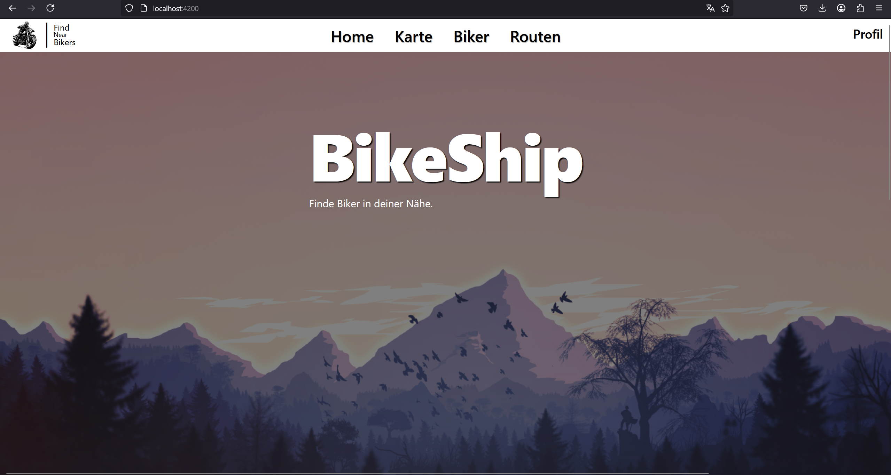
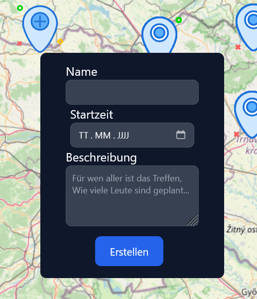

# BikeShip

BikeShip is a community-driven platform that connects bikers and helps them create meetups. With an interactive map feature, users can find and join biking groups, plan rides, and explore new routes together.

## 🚀 Features

- 🗺 **Find Bikers on a Map** – Discover nearby bikers using OpenLayers.
- 📍 **Create & Join Meetups** – Organize or join biking events.
- 🏍 **Community-Driven** – Connect with fellow biking enthusiasts.
- ⚡ **Fast & Responsive** – Built with modern web technologies.

## 🛠 Tech Stack

- **Frontend**: [Angular](https://angular.io/) + [Vite](https://vitejs.dev/) + [TypeScript](https://www.typescriptlang.org/)
- **Styling**: [Tailwind CSS](https://tailwindcss.com/)
- **Mapping**: [OpenLayers](https://openlayers.org/)

## 🔧 Installation

1. Clone the repository:
   ```sh
   git clone https://github.com/KraetSpg/BikeShip.git
   cd BikeShip
   ```
2. Install dependencies:
   ```sh
   npm install // in both root and bikeship-ui
   ```
3. Start the development server:
   ```sh
   npm start // in bikeship ui
   ```

## 📸 Screenshots






## 📌 Contributing

We welcome contributions! Feel free to open an issue or submit a pull request.

---
Made with ❤️ for bikers!
